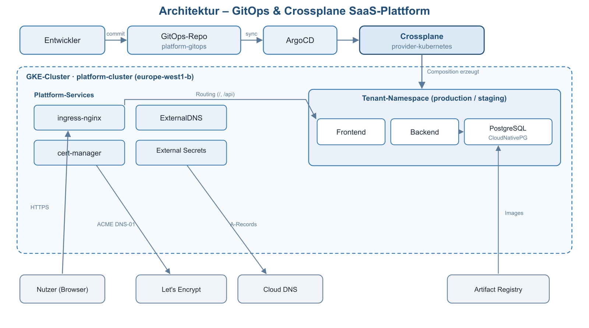
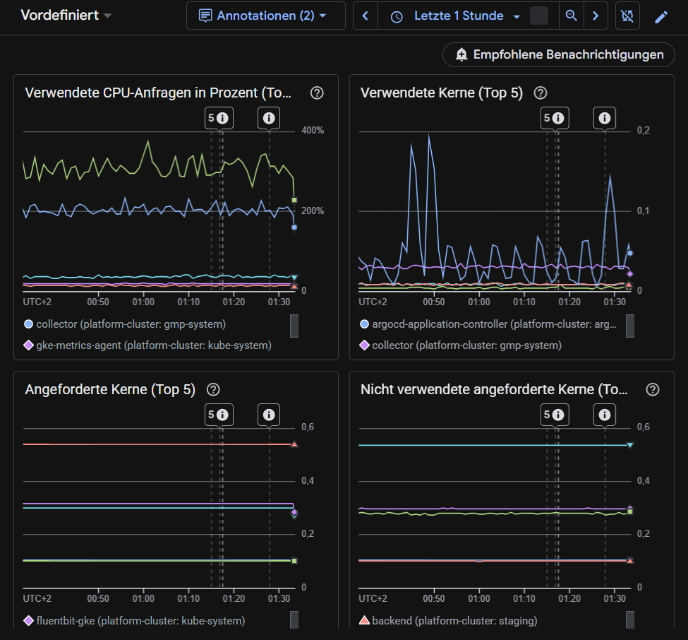
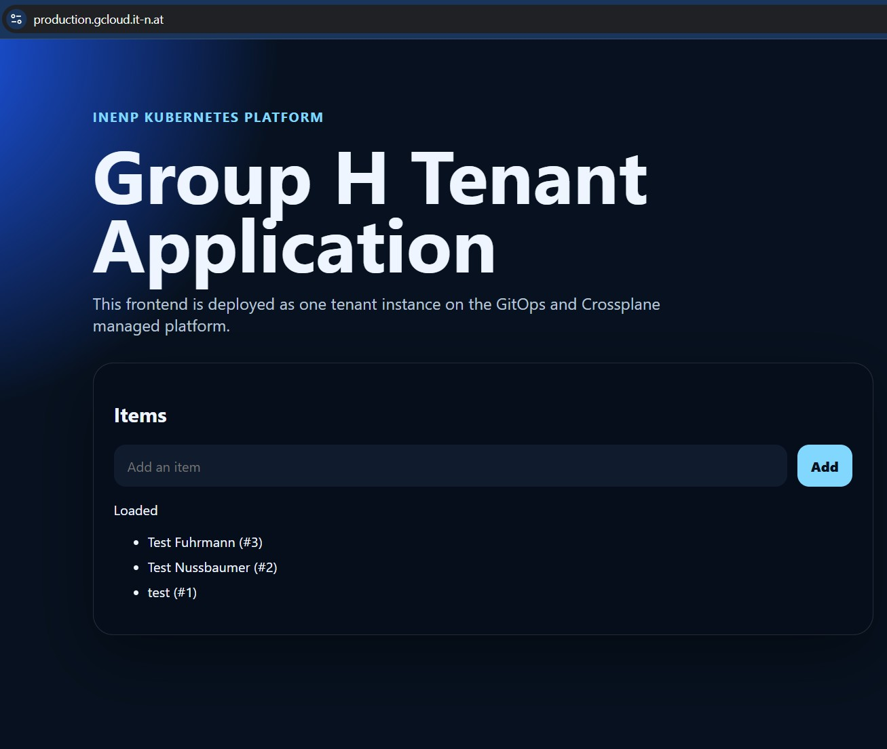
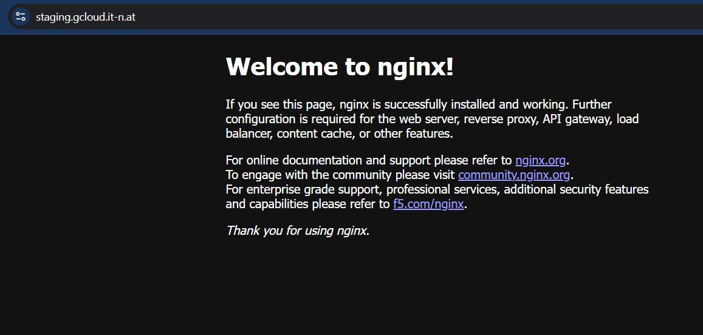
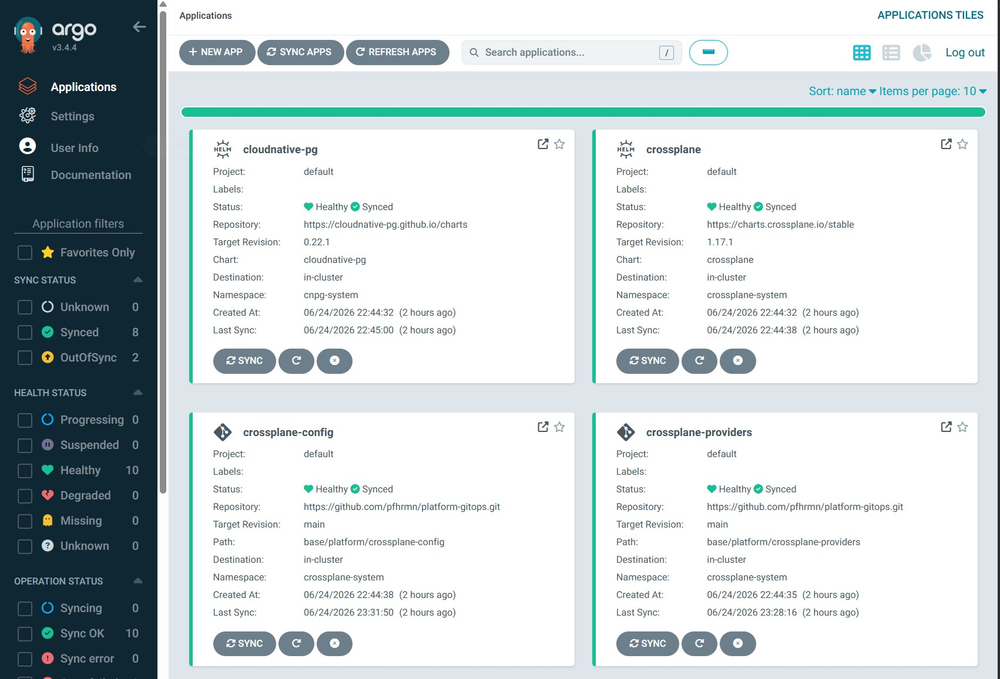
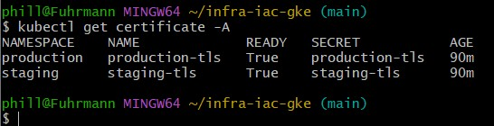
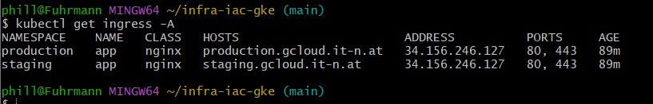
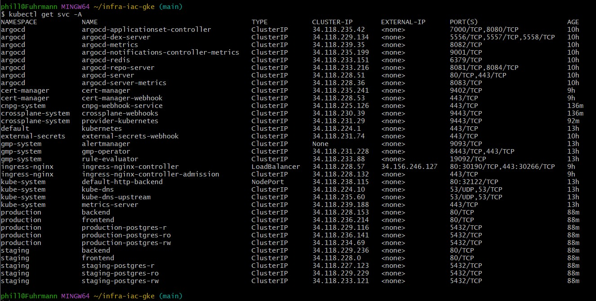

# platform-gitops

Dieses Repository enthält die GitOps-Konfiguration für die Kubernetes‑Plattform.  
ArgoCD synchronisiert die Inhalte dieses Repositories kontinuierlich auf den GKE‑Cluster.

---

## Übersicht

Das Repository stellt alle zentralen Plattform‑Komponenten bereit, die für den Betrieb der Umgebung notwendig sind. Dazu gehören:

- ArgoCD App‑of‑Apps Struktur
- Cert‑Manager (TLS-Zertifikate)
- ExternalDNS (automatische DNS‑Einträge)
- External Secrets Operator (Secrets aus Google Secret Manager)
- Ingress-Konfiguration
- Basis‑Namespaces und Plattform‑Services

Die Struktur ist so aufgebaut, dass Erweiterungen und spätere Automatisierungen problemlos ergänzt werden können.

*Architektur: Entwickler → GitOps-Repo → ArgoCD → Crossplane; pro Tenant Frontend, Backend und PostgreSQL, dazu die Plattform-Services und die externen Anbindungen (Let's Encrypt, Cloud DNS, Artifact Registry).*

---

## Repository‑Struktur

### `base/`
Enthält alle globalen Plattform‑Services.

#### `base/cert-manager/`
- `cluster-issuer.yaml`  
  Konfiguration für automatische TLS‑Zertifikate.

#### `base/external-dns/`
- `external-dns.yaml`  
  DNS‑Synchronisation mit Google Cloud DNS.

#### `base/external-secrets/`
- `app.yaml`  
- `helm-release.yaml`  
- `secretstore.yaml`  
- `test-secret.yaml`  
  Bindet Secrets aus Google Secret Manager ein.

#### `base/ingress/`
- `app-ingress.yaml`  
  Globale HTTPS‑Ingress‑Konfiguration.

#### `base/platform/`
- `root-app.yaml`  
- `platform-apps.yaml`  
- `base-app.yaml`  
- `test-namespace.yaml`  
  ArgoCD App‑of‑Apps Root und Plattform‑Services.

---

### `tenants/`
Struktur für spätere Tenant‑Konfigurationen:

- `staging.yaml`
- `production.yaml`
- `release-staging.yaml`
- `release-production.yaml`
- `kustomization.yaml`
- `README.md`
- `PROMPTS.md`

Diese Dateien definieren Umgebungen, Namespaces und Release‑Konfigurationen.  
Sie dienen als Grundlage für die spätere Tenant‑Automatisierung.

---

## ArgoCD Integration

ArgoCD lädt die Root‑Application aus: "base/root-app.yaml"

Von dort werden alle weiteren Komponenten automatisch synchronisiert:

- Plattform‑Services  
- Ingress  
- DNS  
- Zertifikate  
- Secrets  
- Tenant‑Struktur  

Änderungen in diesem Repository werden automatisch in den Cluster übernommen.

---

## Secrets

Dieses Repository enthält keine sensiblen Daten.  
Secrets werden ausschließlich über den **External Secrets Operator** aus Google Secret Manager bezogen.

---

## Weitere Informationen

Dokumentation zur Tenant‑Plattform befindet sich unter: "docs/crossplane-tenant-platform.md"

Das Infrastruktur‑Repository (GKE, DNS, IAM, Bootstrap): "infra-iac-gke"

---

## Monitoring (Bonus)

Ressourcenverbrauch und Healthiness pro Tenant werden über **Google Managed Prometheus** + **Cloud Monitoring** erfasst und im Dashboard „Group H – Tenant App Monitoring" visualisiert (CPU, Speicher, Container-Restarts, laufende Pods je Namespace). Details und Dashboard-as-Code: [`docs/monitoring.md`](docs/monitoring.md).

*Cloud-Monitoring-Dashboard – Verbrauch & Healthiness je Tenant*

---

## Screenshots / Nachweis

Die laufende Plattform – öffentlich erreichbar, gültiges TLS:

*Produktions-Tenant – https://production.gcloud.it-n.at*

*Staging-Tenant – https://staging.gcloud.it-n.at*

*ArgoCD – synchronisierte Plattform- und Tenant-Applications*

*Gültige TLS-Zertifikate je Tenant (kubectl get certificate -A)*

*Tenant-Ingresses (kubectl get ingress -A)*

*Laufende Pods – Plattform + Tenants (kubectl get pods -A)*

*Services je Tenant (kubectl get svc -A)*

