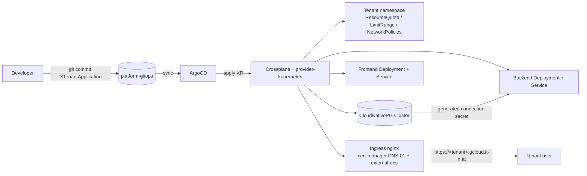

# Crossplane Tenant SaaS Platform (Person 2 / Day 2)

This document describes the **application-management** layer of the platform: how
tenant instances of the 3-tier SaaS application are provisioned on-the-fly through
**GitOps + Crossplane**. It is owned by Person 2.

> One Git commit = one new tenant. ArgoCD + Crossplane do everything else.

## Scope & status

- **Done:** Crossplane control plane, `provider-kubernetes` + `ProviderConfig`,
  the `XTenantApplication` XRD + Composition, per-tenant CloudNativePG database,
  soft multi-tenancy (namespace, ResourceQuota, LimitRange, NetworkPolicies),
  backend/frontend deployment, per-tenant Ingress, `production` + `staging`
  tenants, and the staging-first image rollout.
- **Depends on (Person 1 / infrastructure):** a running GKE cluster with ArgoCD,
  `ingress-nginx`, `cert-manager` (ClusterIssuer `letsencrypt-dns01`, DNS-01),
  `external-dns` (domain filter `gcloud.it-n.at`), and Workload Identity for those
  DNS/TLS components. See the "Platform-services contract" below.

## Related repositories

| Repo | Purpose |
|---|---|
| [`pfhrmn/infra-iac-gke`](https://github.com/pfhrmn/infra-iac-gke) | IaC: GKE cluster, network, IAM/Workload Identity, ArgoCD bootstrap (Person 1) |
| [`pfhrmn/platform-gitops`](https://github.com/pfhrmn/platform-gitops) | GitOps: platform services + this Crossplane tenant layer |

## Architecture — tenant provisioning flow

## Components & sync order

Installed as an app-of-apps under `base/platform-apps.yaml` → `base/platform/applications/*`.
ArgoCD `sync-wave` enforces ordering:

| Wave | Application | What it does |
|---|---|---|
| 0 | `crossplane` | Crossplane core (Helm `1.17.1`) into `crossplane-system` |
| 0 | `cloudnative-pg` | CloudNativePG operator (Helm `0.22.1`) into `cnpg-system` |
| 1 | `crossplane-providers` | `provider-kubernetes` v1.2.1 + `DeploymentRuntimeConfig` + `cluster-admin` binding |
| 2 | `crossplane-config` | `ProviderConfig` `in-cluster` (InjectedIdentity) |
| 2 | `crossplane-tenant-api` | `XTenantApplication` XRD + Composition |
| 3 | `tenants` | `production` + `staging` tenants + image-release ConfigMaps |

`provider-kubernetes` authenticates **in-cluster via its own ServiceAccount**
(`InjectedIdentity`, bound to `cluster-admin`) — so the tenant layer needs **no GCP
credentials / Workload Identity** of its own.

## The `XTenantApplication` API

A cluster-scoped composite resource (`platform.it-n.at/v1alpha1`). Spec fields:

| Field | Required | Default | Notes |
|---|---|---|---|
| `tenantName` | yes | — | DNS-label safe (`^[a-z0-9]([-a-z0-9]*[a-z0-9])?$`) |
| `domain` | yes | — | full FQDN, e.g. `staging.gcloud.it-n.at` |
| `backendImage` | yes | — | injected by the release ConfigMap (see updates) |
| `frontendImage` | yes | — | injected by the release ConfigMap |
| `replicas` | no | `1` | 1–3 |
| `databaseSize` | no | `1Gi` | CloudNativePG storage |

## Create a new tenant (how to contribute)

1. Add a file under `tenants/` (copy `production.yaml`), set `tenantName`, `domain`,
   and the `platform.it-n.at/release-channel` label (`production` or `staging`).
2. Add it to `tenants/kustomization.yaml` `resources`.
3. Open a PR. After merge, ArgoCD + Crossplane create the namespace, database,
   backend/frontend, and the `https://<domain>` endpoint automatically.

## Application updates & staging-first rollout

Image versions are **not** stored on the tenants; they live in two ConfigMaps and
are injected at build time via Kustomize `replacements`, selected by the
`release-channel` label:

- `tenants/release-staging.yaml` → all `staging` tenants
- `tenants/release-production.yaml` → all `production` tenants

**Flow:** bump the image in `release-staging.yaml` → validate on the staging tenant
→ copy the same image refs into `release-production.yaml` → one commit rolls the new
version to **all** production tenants.

## Multi-tenancy & isolation (soft)

Each tenant gets its own namespace plus, from the Composition:

- **ResourceQuota** (cpu/memory requests+limits, pod count) and **LimitRange** defaults
- **NetworkPolicies**: default-deny ingress, then explicit allows
  (ingress-nginx → frontend/backend, backend → postgres, cnpg-system → postgres,
  postgres self-traffic). Enforced by Calico.

## Database (CloudNativePG)

Per tenant the Composition creates a `postgresql.cnpg.io/v1` `Cluster`. CNPG
auto-generates the `app` database/user and a `<tenant>-postgres-app` secret
(`username`/`password`), which the backend consumes via `secretKeyRef`. Upgrades are
handled by the operator (assignment: "scalable option" + "automated upgrades"). No
plaintext secrets are stored in Git.

## Platform-services contract (provided by Person 1)

This tenant layer assumes the cluster already provides:

- `ingress-nginx` controller (ingress class `nginx`)
- `cert-manager` with `ClusterIssuer` **`letsencrypt-dns01`** (ACME DNS-01)
- `external-dns` with domain filter **`gcloud.it-n.at`** and Cloud DNS access
- A reachable Crossplane/ArgoCD install

## Endpoints

- Production: `https://production.gcloud.it-n.at`
- Staging: `https://staging.gcloud.it-n.at`
